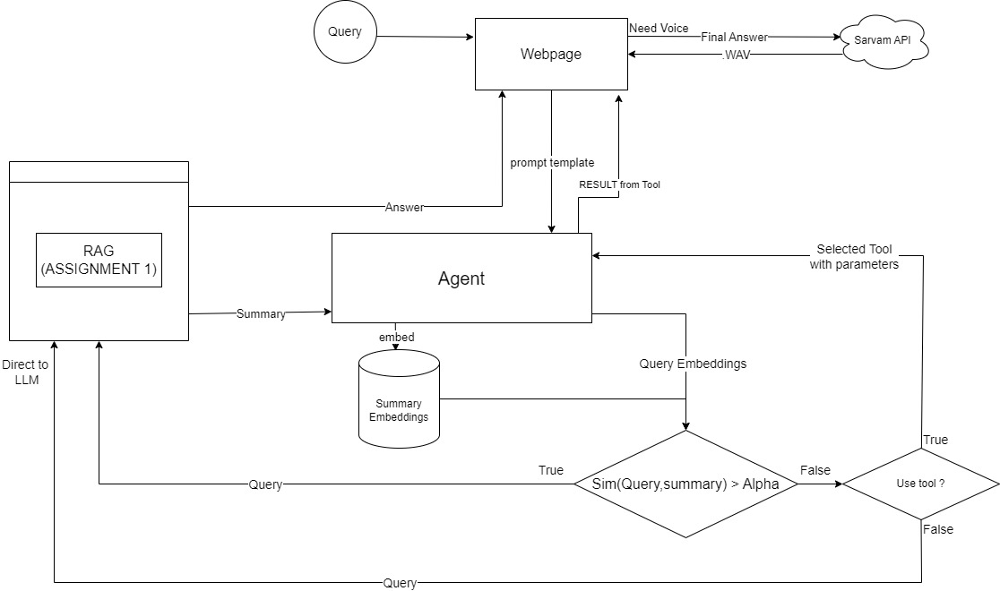

# Agentic RAG System
### Overview

This project is part of an assignment to build a Retrieval-Augmented Generation (RAG) system that leverages PDFs to answer user queries. The project involves two main tasks:

1. Building a RAG system using NCERT PDFs and serving it through a FastAPI endpoint.
2. Extending the system by introducing an agent that can decide when to query the VectorDB or perform other actions based on the user's query.

The system provides a simple web-based user interface to upload PDFs, ask questions, and interact with the agent.

## Assignment Requirements
### Part 1: Building a RAG System
    Use NCERT PDF text as the data source for domain knowledge.
    Chunk and index the PDF content in a VectorDB.
    Use a FastAPI endpoint to serve the RAG system and process user queries.
### Part 2: Building an Agent
    The agent decides when to call the VectorDB based on the user's query.
    The agent can decide the tool to use based on user query and execute it.
### Part 3: Adding Voice to Agent:
    Audio generated for final answer using Sarvam API
    
## Project Structure

    agentic_rag/	
    │
    ├── Outputs /                    # Folder for images 
    ├── Uploads /                    # Folder for saving uploaded files
    ├── app.py                       # Main FastAPI application file
    ├── embeddings.py                # Handles embedding creation using Sentence Transformers
    ├── functions.py                 # Tools for Agent
    ├── generator.py                 # LLM model for generating text
    ├── indexer_retriever.py         # Indexing PDF text in FAISS DB and retrieving relevant documents
    ├── pdfloader.py                 # PDF loader to extract and process text from uploaded PDFs  
    ├── semantics.py                 # Module to handle semantic similarity calculation
    ├── webpage.html                 # Simple web interface to upload PDFs and interact with the system  
    ├── requirements.txt             # Project dependencies
    └── README.md                    

## Features
- PDF Processing: Upload PDFs, extract text, and chunk it for indexing.
- RAG System: Queries are processed using FAISS VectorDB for retrieval and the LLM for response generation. 
- Agent: Smart agent decides whether to call the VectorDB based on semantic similarity between the user's query and the document summary. If the query is irrelevant, it avoids querying the database.
- Web Interface: A Static Local frontend where users can:
    - Upload PDFs in runtime rather than static pdf usage for vectorDB
    - Ask questions directly to RAG
    - Ask Agent and use tools
    - Listen to the Answer
    
## Flowchart
Assignment - 1: 

Assignment - 2 & 3:

## Setup Instructions

Clone the repository:
    
    git clone https://github.com/tejaram11/agentic_rag.git
    cd agentic_rag

Install the required dependencies:

    pip install -r requirements.txt

Running the Application

- Start the FastAPI server:
    - if you want to compute in remote server

            python app.py --use-remote

    - Then the fastAPI app will create a tunnel using ngrok and provide a PUBLIC_URL
    - Replace this PUBLIC_URL in API_URL in webpage using "change API URL" 

    - if you want to compute in same machine
    
            python app.py

- Open "webpage.html" in your browser

## Endpoints
- /upload:

Upload PDF: Allows uploading an NCERT PDF and processing it into chunks for indexing.

- /ask :

Ask a Question: Submits a question to the system and retrieves an answer by querying the VectorDB and generating a response.

- /agent:

Ask Agent: Submits a query to the agent, which decides whether to call the VectorDB or use the tool or directly generate the response. 

- /generate-audio:

Generate Audio: Generates audio for final answer using sarvam API

## Sample results:
- webpage:

- Changing API url: 

- Using RAG:

- Using Agent:

- Using Tool:

- Agent Voice:
[output_audio.webm](https://github.com/user-attachments/assets/291c25ed-b877-4d2d-95fe-12233b906528)
